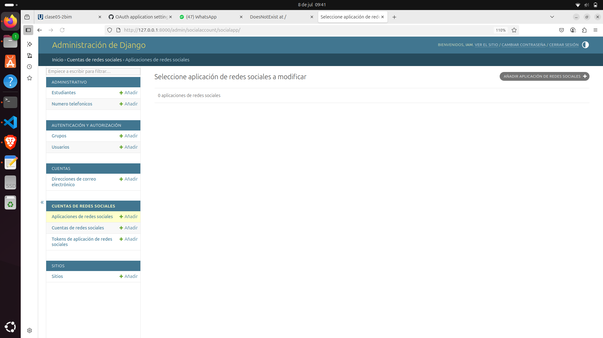
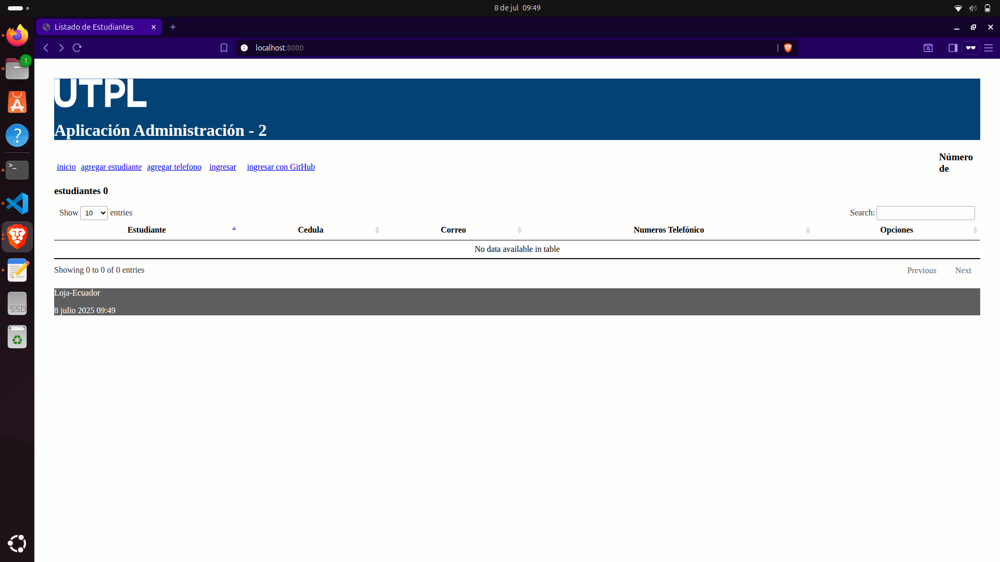
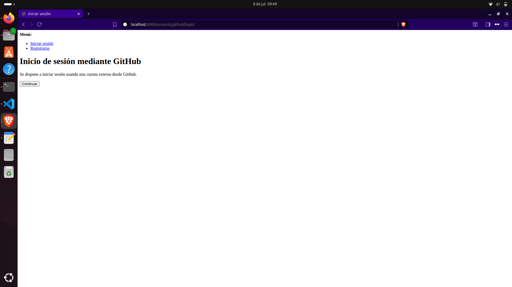
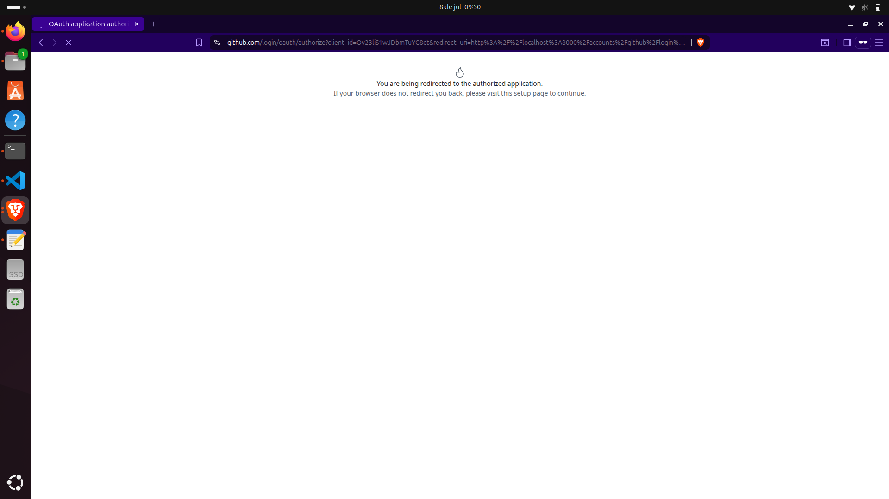
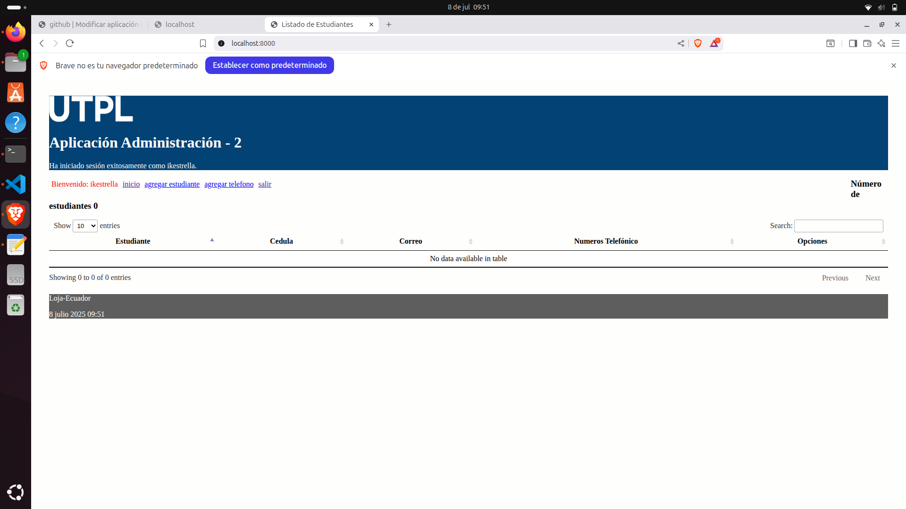
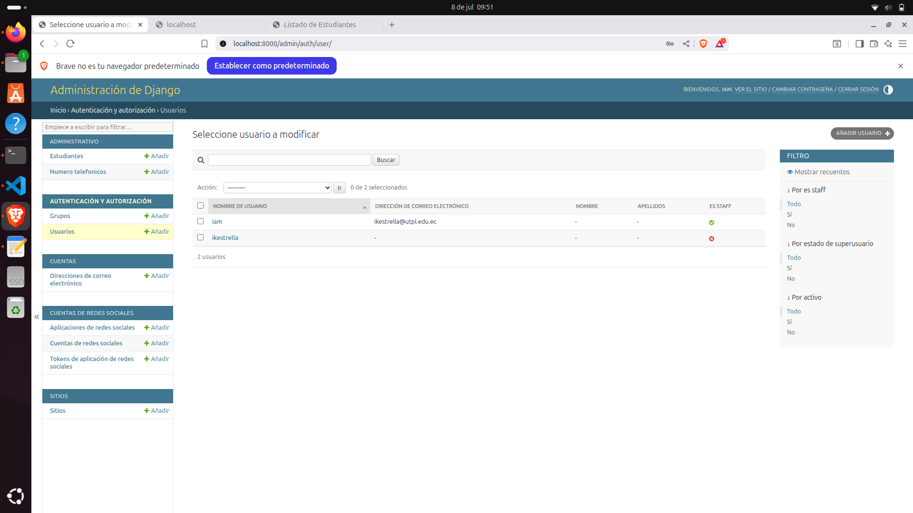

# clase05-2bim

Uso de la aplicación django-allauth.

Página oficial 

* https://django-allauth.readthedocs.io/en/latest/index.html
 
Instalar a través de:

* pip install django django-allauth

Algunas parte del proceso son referenciados del ejemplo explicado en:

* https://kodnito.com/posts/django-authentication-github/

